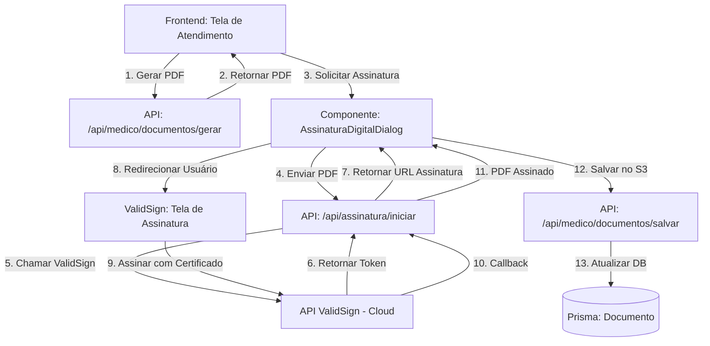

# Integração de Assinatura Digital ICP-Brasil com CFM e Valid

## Visão Geral

Este plano implementa assinatura digital ICP-Brasil usando a API ValidSign (Valid) com certificados em nuvem, integrada na tela de atendimento para assinar documentos médicos gerados.

## Arquitetura

## Componentes Principais

### 1. Backend - API de Assinatura Digital

**Arquivo:** `app/api/assinatura/iniciar/route.ts`

- Endpoint para iniciar processo de assinatura
- Integração com API ValidSign (REST)
- Gerenciamento de tokens e callbacks
- Validação de certificado ICP-Brasil

**Arquivo:** `app/api/assinatura/callback/route.ts`

- Webhook para receber confirmação da ValidSign
- Processar PDF assinado
- Atualizar status do documento

**Arquivo:** `lib/valid-sign-client.ts`

- Cliente para comunicação com API ValidSign
- Métodos: iniciar assinatura, verificar status, baixar PDF assinado
- Tratamento de erros e retry

### 2. Frontend - Componente de Assinatura

**Arquivo:** `components/assinatura-digital-dialog.tsx`

- Dialog modal para iniciar assinatura
- Exibição de status (pendente, assinando, concluído)
- Preview do documento antes de assinar
- Integração com fluxo de assinatura ValidSign

**Arquivo:** `hooks/use-assinatura-digital.ts`

- Hook customizado para gerenciar estado de assinatura
- Polling de status da assinatura
- Gerenciamento de erros

### 3. Integração na Tela de Atendimento

**Arquivo:** `app/(protected)/medico/atendimento/atendimento-content.tsx`

- Adicionar botão "Assinar Digitalmente" após gerar documento
- Integrar componente de assinatura
- Atualizar lista de documentos com status de assinatura

**Arquivo:** `components/document-models-sheet.tsx`

- Adicionar opção de assinatura digital no fluxo de geração
- Indicador visual para documentos que requerem assinatura

### 4. Modificações nos Geradores de PDF

**Arquivos:** `lib/pdf/*.ts`

- Adicionar campo para indicar se documento foi assinado digitalmente
- Incluir metadados de assinatura no PDF (quando aplicável)
- Manter compatibilidade com documentos não assinados

### 5. Banco de Dados

**Arquivo:** `prisma/schema.prisma`

- Adicionar campos na tabela `Documento`:
  - `assinadoDigitalmente: Boolean`
  - `assinaturaToken: String?` (token da ValidSign)
  - `assinaturaData: DateTime?`
  - `assinaturaCertificado: String?` (info do certificado)
  - `assinaturaValida: Boolean`

### 6. Configuração e Variáveis de Ambiente

**Arquivo:** `.env`

- `VALIDSIGN_API_KEY` - Chave da API ValidSign
- `VALIDSIGN_API_URL` - URL base da API
- `VALIDSIGN_CALLBACK_URL` - URL para callbacks
- `VALIDSIGN_WEBHOOK_SECRET` - Secret para validar webhooks

## Fluxo de Assinatura

1. **Geração do Documento**: Médico gera documento na tela de atendimento
2. **Solicitação de Assinatura**: Clica em "Assinar Digitalmente"
3. **Início do Processo**: Frontend chama API para iniciar assinatura
4. **Integração ValidSign**: Backend cria sessão na ValidSign e retorna URL
5. **Redirecionamento**: Usuário é redirecionado para tela ValidSign
6. **Autenticação**: Usuário autentica com certificado digital (nuvem)
7. **Assinatura**: ValidSign processa assinatura ICP-Brasil
8. **Callback**: ValidSign notifica backend via webhook
9. **Download**: Backend baixa PDF assinado
10. **Armazenamento**: PDF assinado é salvo no S3
11. **Atualização**: Status do documento é atualizado no banco
12. **Notificação**: Frontend recebe notificação de conclusão

## Documentos que Serão Assinados

Todos os documentos médicos exceto controles:

- Atestados (todos os tipos)
- Receitas (simples e controle especial)
- Declarações de comparecimento
- Guias de encaminhamento
- Justificativas de exames
- Laudos médicos
- Termos de consentimento

## Validação ICP-Brasil

- Verificar se certificado é emitido por AC ICP-Brasil
- Validar cadeia de certificação
- Verificar se certificado não está revogado
- Confirmar que assinatura é válida e íntegra

## Segurança

- Tokens de assinatura armazenados de forma segura
- Validação de webhooks com secret
- Autenticação obrigatória para todas as APIs
- Logs de auditoria para assinaturas

## Tratamento de Erros

- Timeout de assinatura (30 minutos)
- Retry automático em falhas de rede
- Notificações de erro ao usuário
- Fallback para assinatura manual (opcional)

## Testes

- Testes unitários para cliente ValidSign
- Testes de integração com API ValidSign (sandbox)
- Testes E2E do fluxo completo de assinatura
- Validação de documentos assinados

## Dependências

- `axios` ou `fetch` para chamadas HTTP
- `@valid/sign-sdk` (se disponível) ou integração REST manual
- Biblioteca de validação de certificados ICP-Brasil (opcional)

## Migração

- Criar migration Prisma para novos campos
- Manter compatibilidade com documentos existentes
- Script de migração para documentos antigos (opcional)