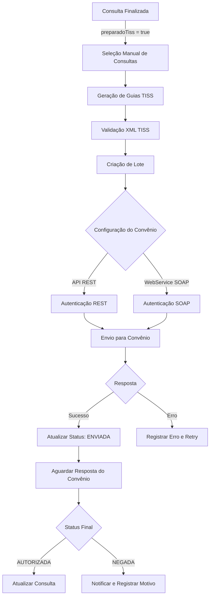

# Plano de Integração TISS

## Visão Geral

Implementação completa do sistema de integração TISS (Troca de Informação em Saúde Suplementar) para geração, lotes e envio de guias para convênios. O sistema suporta múltiplos tipos de API (REST e SOAP) e métodos de autenticação variáveis por convênio.

## Arquitetura do Fluxo



## Componentes Principais

### 1. Modelo de Dados - Credenciais de API

**Arquivo:** `prisma/schema.prisma`

Adicionar ao modelo `Operadora`:

- `tipoApi` (REST, SOAP, AMBOS)
- `urlBase` (URL base da API)
- `endpointEnvio` (endpoint específico para envio)
- `endpointConsulta` (endpoint para consultar status)
- `tipoAutenticacao` (JWT, BASIC_AUTH, OAUTH2, CERTIFICADO_DIGITAL)
- `credenciais` (JSON criptografado com credenciais)
- `certificadoDigital` (caminho/ID do certificado)
- `configuracaoLote` (JSON com tamanho máximo de lote, intervalo entre envios)

Criar modelo `LoteTiss`:

- `id`, `clinicaId`, `operadoraId`
- `numeroLote` (único)
- `quantidadeGuias`
- `status` (PENDENTE, ENVIANDO, ENVIADO, PROCESSADO, ERRO)
- `dataEnvio`, `dataResposta`
- `xmlLote` (XML completo do lote)
- `respostaXml` (resposta do convênio)
- `observacoes`

Criar modelo `GuiaTissEnvio` (relacionamento N:N entre GuiaTiss e LoteTiss):

- `guiaTissId`, `loteTissId`
- `ordem` (ordem no lote)

### 2. Serviço de Geração XML TISS

**Arquivo:** `lib/tiss/xml-generator.ts`

Responsabilidades:

- Gerar XML conforme padrão TISS (versão mais recente da ANS)
- Validar estrutura XML antes de salvar
- Gerar número único de guia
- Mapear dados da consulta para formato TISS
- Incluir dados do prestador (clínica)
- Incluir dados do beneficiário (paciente)
- Incluir dados do procedimento (código TUSS)
- Incluir dados do profissional (médico)

Estrutura XML base:

```xml
<ans:mensagemTISS>
  <ans:cabecalho>...</ans:cabecalho>
  <ans:prestadorParaOperadora>...</ans:prestadorParaOperadora>
  <ans:loteGuias>...</ans:loteGuias>
</ans:mensagemTISS>
```

### 3. Serviço de Autenticação

**Arquivo:** `lib/tiss/auth-service.ts`

Suportar múltiplos métodos:

- **JWT**: Obter token via endpoint de autenticação, armazenar temporariamente
- **Basic Auth**: Usar credenciais diretamente no header
- **OAuth2**: Fluxo completo OAuth2 com refresh tokens
- **Certificado Digital**: Usar certificado A1/A3 para assinatura

Interface unificada:

```typescript
interface AuthProvider {
  authenticate(): Promise<AuthToken>;
  refreshToken?(token: AuthToken): Promise<AuthToken>;
}
```

### 4. Serviço de Envio

**Arquivo:** `lib/tiss/envio-service.ts`

Suportar REST e SOAP:

- **REST**: HTTP POST com XML no body
- **SOAP**: Envelope SOAP com XML TISS

Funcionalidades:

- Enviar lote completo
- Processar resposta (sucesso/erro)
- Retry automático com backoff exponencial
- Logging detalhado de requisições/respostas
- Timeout configurável

### 5. API de Geração de Lotes

**Arquivo:** `app/api/tiss/lotes/route.ts`

Endpoints:

- `POST /api/tiss/lotes` - Criar novo lote
  - Body: `{ consultaIds: string[], operadoraId: string }`
  - Valida se consultas estão prontas (`preparadoTiss = true`)
  - Gera XML para cada guia
  - Cria lote e associa guias
  - Retorna lote criado

- `GET /api/tiss/lotes` - Listar lotes
  - Filtros: status, operadora, data
  - Paginação

- `GET /api/tiss/lotes/[loteId]` - Detalhes do lote
  - Inclui lista de guias
  - Status de cada guia
  - XML do lote

- `POST /api/tiss/lotes/[loteId]/enviar` - Enviar lote
  - Busca configuração da operadora
  - Autentica conforme tipo
  - Envia lote
  - Atualiza status

### 6. Interface de Usuário

**Arquivo:** `app/(protected)/admin-clinica/tiss/lotes/page.tsx`

Funcionalidades:

- Lista de consultas prontas para gerar guias
- Seleção múltipla de consultas
- Filtros: operadora, data, status
- Criação de lote
- Visualização de lotes criados
- Envio manual de lotes
- Monitoramento de status
- Visualização de erros

### 7. Job de Processamento

**Arquivo:** `lib/tiss/job-processor.ts`

Processamento assíncrono:

- Consultar status de guias enviadas
- Processar respostas pendentes
- Retry automático de falhas
- Notificações de status

### 8. Configuração de Operadoras

**Arquivo:** `app/(protected)/admin-clinica/operadoras/[id]/configuracao-tiss/page.tsx`

Interface para:

- Configurar tipo de API (REST/SOAP)
- Configurar URLs e endpoints
- Configurar método de autenticação
- Cadastrar credenciais (criptografadas)
- Upload de certificado digital
- Configurar tamanho de lote
- Testar conexão

## Fluxo Detalhado

### 1. Após Finalizar Consulta

Quando o prontuário é salvo (`POST /api/medico/atendimento`):

- Marcar `preparadoTiss = true` na consulta
- Consulta fica disponível para geração de guia

### 2. Geração Manual de Lote

1. Usuário acessa tela de lotes TISS
2. Sistema lista consultas com `preparadoTiss = true` e sem guia gerada
3. Usuário seleciona consultas e operadora
4. Sistema valida:

   - Consultas pertencem à mesma operadora
   - Consultas têm todos os dados necessários
   - Operadora tem configuração TISS completa

5. Para cada consulta:

   - Gerar XML da guia TISS
   - Criar registro em `GuiasTiss` (status: GERADA)
   - Validar XML

6. Criar `LoteTiss`:

   - Agrupar guias por operadora
   - Gerar número único do lote
   - Montar XML do lote completo
   - Status: PENDENTE

### 3. Envio do Lote

1. Usuário clica em "Enviar Lote"
2. Sistema busca configuração da operadora:

   - Tipo de API
   - Método de autenticação
   - URLs/endpoints

3. Autenticação:

   - Conforme tipo, obter token/credenciais
   - Armazenar temporariamente

4. Envio:

   - Montar requisição (REST ou SOAP)
   - Incluir XML do lote
   - Enviar para endpoint do convênio

5. Processar resposta:

   - Se sucesso: atualizar status para ENVIADO
   - Se erro: registrar erro, manter PENDENTE
   - Salvar XML de resposta

### 4. Processamento de Resposta

1. Job periódico consulta status de lotes ENVIADOS
2. Para cada lote:

   - Chamar endpoint de consulta do convênio
   - Processar resposta
   - Atualizar status das guias:
     - AUTORIZADA: atualizar consulta
     - NEGADA: registrar motivo
   - Atualizar status do lote: PROCESSADO

## Estrutura de Arquivos

```

lib/tiss/

├── xml-generator.ts          # Geração de XML TISS

├── xml-validator.ts          # Validação de XML

├── auth-service.ts           # Autenticação variável

├── rest-client.ts            # Cliente REST

├── soap-client.ts            # Cliente SOAP

├── envio-service.ts          # Serviço unificado de envio

├── lote-service.ts           # Gerenciamento de lotes

├── job-processor.ts          # Processamento assíncrono

└── types.ts                  # Tipos TypeScript

app/api/tiss/

├── lotes/

│   ├── route.ts              # CRUD de lotes

│   └── [loteId]/

│       ├── route.ts           # Detalhes do lote

│       └── enviar/

│           └── route.ts       # Enviar lote

├── guias/

│   └── route.ts              # Listar guias

└── consultar-status/