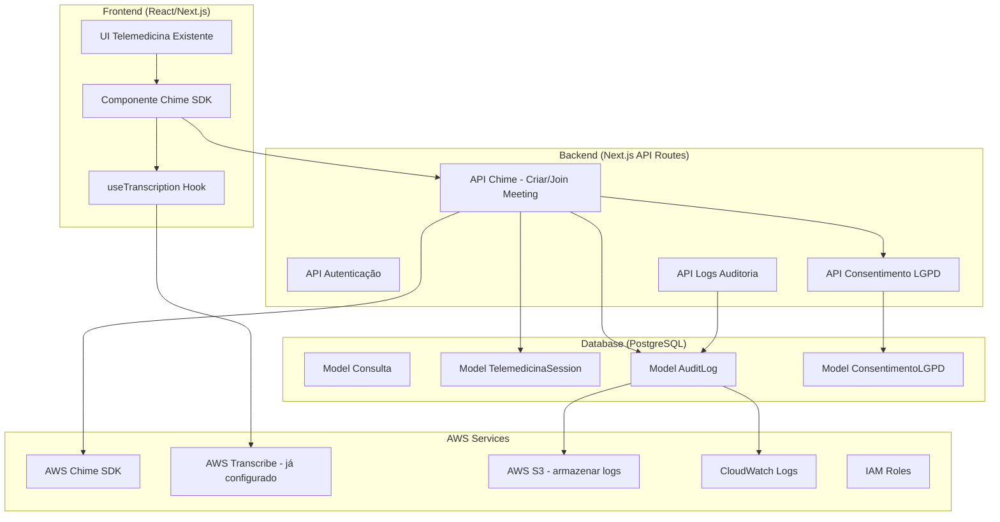
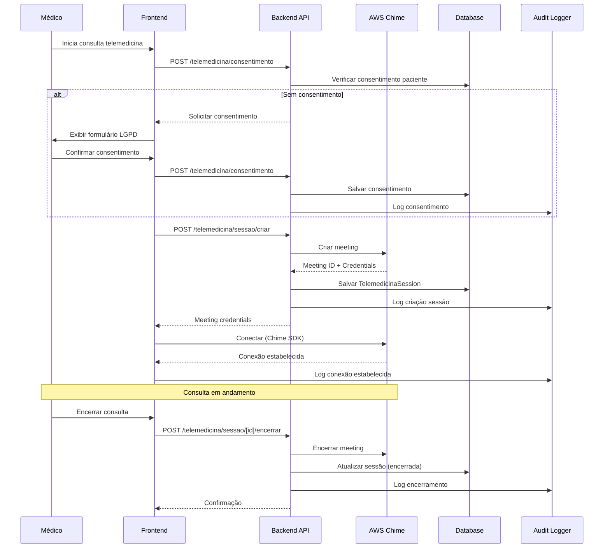

# Sistema de Telemedicina com AWS Chime SDK - Implementação Completa

## Visão Geral

Implementar sistema de telemedicina seguro e em compliance usando AWS Chime SDK, integrando com a UI existente em `app/(protected)/medico/atendimento/atendimento-content.tsx`. O sistema incluirá autenticação, logs de auditoria, compliance LGPD, e integração com a infraestrutura AWS já existente.

## Arquitetura



## Componentes Principais

### 1. Modelo de Dados (Prisma Schema)

**Arquivo:** `prisma/schema.prisma`

Adicionar modelos:

- `TelemedicinaSession`: Sessões de telemedicina
- `AuditLog`: Logs de auditoria (LGPD)
- `ConsentimentoLGPD`: Consentimentos de pacientes

### 2. Backend - API Routes

**Arquivos a criar:**

- `app/api/telemedicina/sessao/criar/route.ts`: Criar sessão Chime
- `app/api/telemedicina/sessao/[sessionId]/join/route.ts`: Entrar na sessão
- `app/api/telemedicina/sessao/[sessionId]/encerrar/route.ts`: Encerrar sessão
- `app/api/telemedicina/consentimento/route.ts`: Gerenciar consentimentos LGPD
- `app/api/telemedicina/logs/route.ts`: Consultar logs de auditoria

### 3. Frontend - Componentes

**Arquivos a criar/modificar:**

- `components/telemedicina/chime-video-call.tsx`: Componente principal Chime
- `hooks/use-chime-session.ts`: Hook para gerenciar sessão Chime
- `app/(protected)/medico/atendimento/atendimento-content.tsx`: Integrar Chime na UI existente

### 4. Serviços e Utilitários

**Arquivos a criar:**

- `lib/aws/chime-service.ts`: Serviço AWS Chime
- `lib/telemedicina/audit-logger.ts`: Logger de auditoria
- `lib/telemedicina/lgpd-compliance.ts`: Utilitários LGPD
- `lib/telemedicina/consent-manager.ts`: Gerenciador de consentimentos

### 5. Segurança e Compliance

- Autenticação: Usar NextAuth existente
- Autorização: Validar médico e paciente na consulta
- Criptografia: TLS para tráfego, criptografia em repouso (S3)
- Logs: Todos os eventos registrados (LGPD)
- Consentimento: Obrigatório antes de iniciar sessão

## Fluxo de Funcionamento



## Implementação Detalhada

### Fase 1: Infraestrutura e Modelos

1. **Atualizar Prisma Schema**

   - Adicionar modelos `TelemedicinaSession`, `AuditLog`, `ConsentimentoLGPD`
   - Adicionar campos em `Consulta` para referenciar sessão de telemedicina
   - Criar migration

2. **Configurar AWS Chime**

   - Criar IAM role/policy para Chime SDK
   - Configurar variáveis de ambiente
   - Instalar dependências: `amazon-chime-sdk-js`

### Fase 2: Backend APIs

1. **Serviço AWS Chime** (`lib/aws/chime-service.ts`)

   - Criar/gerenciar meetings
   - Gerar attendee credentials
   - Encerrar meetings

2. **APIs de Sessão**

   - Criar sessão com validação de autorização
   - Join session com credenciais temporárias
   - Encerrar sessão com logs

3. **Sistema de Logs** (`lib/telemedicina/audit-logger.ts`)

   - Registrar todos os eventos (criação, join, encerramento)
   - Armazenar em DB e S3 (backup)
   - Formato estruturado para compliance

4. **LGPD Compliance** (`lib/telemedicina/lgpd-compliance.ts`)

   - Gerenciar consentimentos
   - Política de retenção (10 anos)
   - Exclusão de dados (após 10 anos)

### Fase 3: Frontend

1. **Componente Chime** (`components/telemedicina/chime-video-call.tsx`)

   - Integrar Chime SDK JS
   - Gerenciar áudio/vídeo
   - Controles (mute, camera, screen share)
   - Indicadores de qualidade de conexão

2. **Hook de Sessão** (`hooks/use-chime-session.ts`)

   - Gerenciar ciclo de vida da sessão
   - Estados (connecting, connected, disconnected)
   - Tratamento de erros

3. **Integração com UI Existente**

   - Substituir placeholders em `atendimento-content.tsx`
   - Integrar com transcrição existente
   - Manter chat e outras funcionalidades

### Fase 4: Segurança e Compliance

1. **Autenticação/Autorização**

   - Validar médico autenticado
   - Validar paciente da consulta
   - Validar clínica habilitada para telemedicina

2. **Logs de Auditoria**

   - Eventos: criação, join, encerramento, erros
   - Dados: timestamp, usuário, IP, ação, resultado
   - Armazenamento: DB + S3 (backup)

3. **LGPD**

   - Consentimento obrigatório antes da sessão
   - Política de privacidade clara
   - Retenção de 10 anos
   - Direito ao esquecimento (após 10 anos)

## Dependências

**Novas dependências:**

```json
{
  "amazon-chime-sdk-js": "^2.0.0",
  "@aws-sdk/client-chime": "^3.980.0",
  "@aws-sdk/client-chime-sdk-meetings": "^3.980.0"
}
```

**Variáveis de ambiente:**

```env
AWS_CHIME_REGION=us-east-1
AWS_CHIME_APP_INSTANCE_ARN=arn:aws:chime:...
CHIME_MEETING_RETENTION_DAYS=3650  # 10 anos
```

## Logs e Auditoria

**Eventos a registrar:**

- Criação de sessão
- Join de médico/paciente
- Encerramento de sessão
- Erros de conexão
- Consentimentos LGPD
- Acessos a logs

**Formato de log:**

```typescript
{
  timestamp: Date,
  userId: string,
  userType: 'MEDICO' | 'PACIENTE',
  action: string,
  sessionId: string,
  consultaId: string,
  ipAddress: string,
  userAgent: string,
  result: 'SUCCESS' | 'ERROR',
  errorMessage?: string,
  metadata?: Record<string, any>
}
```

## Compliance LGPD

1. **Consentimento**

   - Formulário antes de iniciar sessão
   - Armazenar: data, IP, versão da política
   - Permitir revogação

2. **Retenção**

   - Dados mantidos por 10 anos
   - Processo automático de exclusão após período

3. **Transparência**

   - Logs acessíveis ao paciente
   - Política de privacidade clara

4. **Segurança**

   - Criptografia em trânsito (TLS)
   - Criptografia em repouso (S3)
   - Acesso restrito aos dados

## Testes

1. **Testes unitários**

   - Serviços AWS Chime
   - Audit logger
   - LGPD compliance

2. **Testes de integração**

   - Fluxo completo de sessão
   - Logs de auditoria
   - Consentimentos

3. **Testes de segurança**

   - Autorização de acesso
   - Validação de credenciais
   - Proteção contra acesso não autorizado

## Monitoramento

- CloudWatch para métricas AWS Chime
- Alertas para erros de conexão
- Dashboard de sessões ativas
- Relatórios de compliance

## Próximos Passos Após Implementação

1. Documentação técnica
2. Treinamento de usuários
3. Monitoramento em produção
4. Otimizações baseadas em uso real